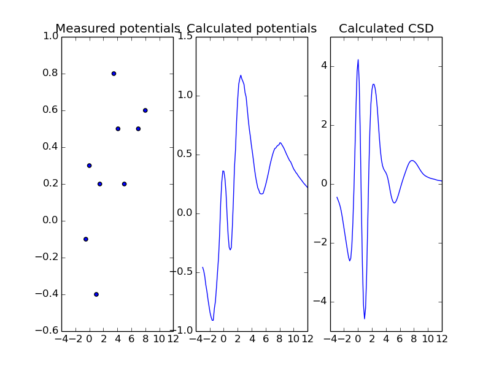
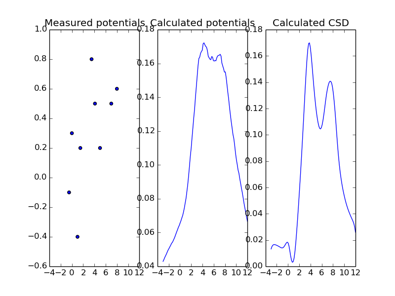
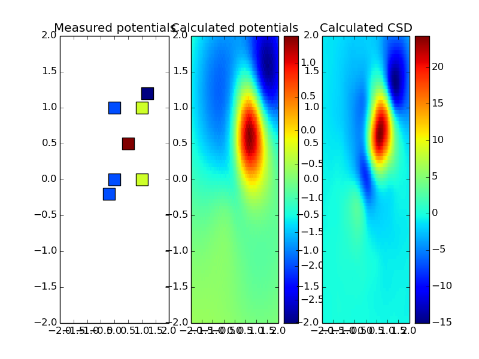

==========
Use Cases
==========

With the pykCSD toolbox you can estimate 1D, 2D and 3D potentials and CSD based on your input data.
Here are the basic examples for each of the reconstructions.

Sample 1D reconstruction
--------------------------

You can estimate potentials measured with electrodes placed along a line::

	from pykCSD.pykCSD import KCSD
	import numpy as np

	#the most inner list corresponds to a position of one electrode
	elec_pos = np.array([[-0.5], [0], [1], [1.5], [3.5], [4.1], [5.0], [7.0], [8.0]])

	#the most inner list corresponds to a time recording made with one electrode
	pots = np.array([[-0.1], [0.3], [-0.4], [0.2], [0.8], [0.5], [0.2], [0.5], [0.6]])

	#you can define model parameters as a dictionary
	params = {
		'xmin': -3.0,
		'xmax': 12.0,
		'source_type': 'gauss',
		'n_sources': 30
	}

	k = KCSD(elec_pos, pots, params)
	
	k.estimate_pots()
	k.estimate_csd()
	
	k.plot_all()

   The sample reconstruction in 1D

Cross validation
-------------------------

Having your kCSD solver set up, you can use cross validation to regularize your results::

	from pykCSD import cross_validation as cv
	from sklearn.cross_validation import LeaveOneOut

	index_generator = LeaveOneOut(len(elec_pos), indices=True)
	lambdas = np.array([10000./x**2 for x in xrange(1, 50)])
	
	k.solver.lambd = cv.choose_lambda(lambdas, pots, k.solver.k_pot, elec_pos, index_generator)

	print k.solver.lambd

	k.estimate_pots()
	k.estimate_csd()
	
	k.plot_all()

	>> 4.16493127863

   The same reconstruction regularized with cross validation

Sample 2D reconstruction
----------------------------

You can estimate potentials and CSD measured with planar electrodes::

	from pykCSD.pykCSD import KCSD
	import numpy as np
	
	elec_pos = np.array([[-0.2, -0.2],[0, 0], [0, 1], [1, 0], [1,1], [0.5, 0.5], [1.2, 1.2]])
	pots = np.array([[-1], [-1], [-1], [0], [0], [1], [-1.5]])
	params = {'gdX': 0.05, 'gdY': 0.05, 'xmin': -2.0, 'xmax': 2.0, 'ymin': -2.0, 'ymax': 2.0}
	
	k = KCSD(elec_pos, pots, params)
	
	k.estimate_pots()
	k.estimate_csd()
	
	k.plot_all()

   The sample reconstruction in 2D

Sample 3D reconstruction
---------------------------

You can also recostruct CSD and LFP using measurements taken by spatial electrodes::

	from pykCSD.pykCSD import KCSD
	import numpy as np

//image//

